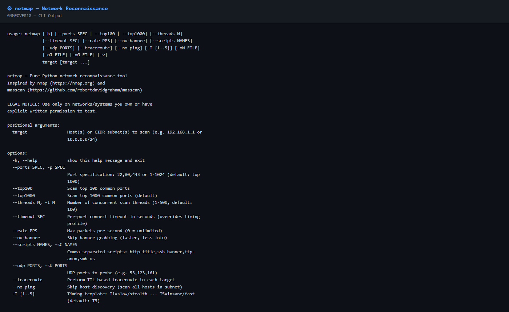

# netmap

**Reines Python-Netzwerk-Reconnaissance-Tool für Security Researcher**

```
  _ __   ___| |_ _ __ ___   __ _ _ __
 | '_ \ / _ \ __| '_ ` _ \ / _` | '_ \
 | | | |  __/ |_| | | | | | (_| | |_) |
 |_| |_|\___|\__|_| |_| |_|\__,_| .__/
                                  |_|
```

> **Inspiriert von [nmap](https://nmap.org) und [masscan](https://github.com/robertdavidgraham/masscan)**  
> Große Dankbarkeit an Gordon Lyon (Fyodor) für nmap und Robert David Graham für masscan — zwei der bedeutendsten Open-Source-Tools der Netzwerksicherheit.

---

## Über dieses Tool

**netmap** ist ein reines Python-Reconnaissance-Tool ohne externe Abhängigkeiten.  
Nur Python-Standardbibliothek: `socket`, `concurrent.futures`, `ipaddress`, `struct`, `json`.

Entwickelt von **G4MEOVER18** für legale Penetrationstests und Netzwerk-Audits.

---

## Feature-Vergleich

| Feature | netmap | nmap |
|---|---|---|
| TCP Connect Scan | ✅ | ✅ |
| SYN Scan (Raw) | ❌ | ✅ (root) |
| UDP Scan | ✅ (DNS/SNMP/NTP) | ✅ |
| Banner Grabbing | ✅ | ✅ |
| Service Detection | ✅ 20+ Dienste | ✅ 1000+ Dienste |
| OS Fingerprinting | ✅ heuristisch (TTL+Banner) | ✅ TCP/IP-Stack-Analyse |
| Subnet-Scan (CIDR) | ✅ | ✅ |
| Scripting Engine | ✅ http-title, ssh-banner, ftp-anon, smb-os | ✅ NSE (Lua) |
| Traceroute | ✅ TTL-basiert | ✅ |
| JSON-Output | ✅ | ✅ (-oX XML) |
| Grepable Output | ✅ (-oG) | ✅ (-oG) |
| Rate Limiting | ✅ | ✅ |
| Timing-Profile | ✅ T1–T5 | ✅ T0–T5 |
| Externe Abhängigkeiten | ❌ keine | ❌ keine |
| Root/Admin nötig | Nur Traceroute | SYN-Scan, OS-Detect |
| Plattform | Python 3.8+, alle Plattformen | Linux/macOS/Windows |

---

## Installation

```bash
# Kein pip, keine Dependencies — einfach klonen und loslegen
git clone https://github.com/G4MEOVER18/netmap.git
cd netmap
python netmap.py --help
```

**Anforderungen:** Python 3.8 oder neuer

---

## Verwendung

### Einzelner Host — Top-1000-Ports (Standard)

```bash
python netmap.py 192.168.1.1
```

### Einzelner Host — bestimmte Ports

```bash
python netmap.py 192.168.1.1 --ports 22,80,443,8080
```

### Portbereich scannen

```bash
python netmap.py 192.168.1.1 --ports 1-1024
```

### Top-100-Ports (schneller)

```bash
python netmap.py 192.168.1.1 --top100
```

### Subnetz scannen (CIDR)

```bash
python netmap.py 192.168.1.0/24
```

### Subnetz ohne vorherige Host-Discovery

```bash
python netmap.py 10.0.0.0/24 --no-ping
```

### Scripts aktivieren

```bash
# HTTP-Titel, SSH-Banner, FTP-Anonymous-Login und SMB-OS-Erkennung
python netmap.py 192.168.1.1 --scripts http-title,ssh-banner,ftp-anon,smb-os
```

### UDP-Ports scannen (DNS, SNMP, NTP)

```bash
python netmap.py 192.168.1.1 --udp 53,123,161
```

### OS-Erkennung (heuristisch)

```bash
python netmap.py 192.168.1.1 --scripts ssh-banner,smb-os
# OS wird automatisch aus TTL und Bannern ermittelt
```

### Traceroute

```bash
python netmap.py 8.8.8.8 --traceroute
```

### Timing-Profile

```bash
python netmap.py 192.168.1.1 -T1   # Langsam/Stealth (paranoid)
python netmap.py 192.168.1.1 -T3   # Normal (Standard)
python netmap.py 192.168.1.1 -T5   # Schnellstmöglich (insane)
```

### Rate-Limiting (z. B. 100 Pakete/Sekunde)

```bash
python netmap.py 192.168.1.0/24 --rate 100
```

### Thread-Anzahl anpassen

```bash
python netmap.py 192.168.1.1 --threads 200 --ports 1-65535
```

### Ausgabe in Dateien

```bash
# Normales Textformat
python netmap.py 192.168.1.1 -oN ergebnis.txt

# JSON (für Weiterverarbeitung/APIs)
python netmap.py 192.168.1.1 -oJ ergebnis.json

# Grepable (für grep/awk/cut)
python netmap.py 192.168.1.1 -oG ergebnis.gnmap
```

### Kombiniertes Beispiel — vollständiger Audit

```bash
python netmap.py 192.168.1.0/24 \
  --top1000 \
  --threads 150 \
  --scripts http-title,ssh-banner,ftp-anon,smb-os \
  --udp 53,123,161 \
  -T3 \
  -oN scan.txt \
  -oJ scan.json \
  -oG scan.gnmap
```

---

## Service-Erkennung

Banner-basierte Erkennung für folgende Dienste:

| Port(s) | Dienst | Erkennungsmethode |
|---|---|---|
| 21 | FTP | 220-Banner, Begrüßungstext |
| 22 | SSH | SSH-2.0-Protokollstring |
| 23 | Telnet | IAC-Optionsverhandlung |
| 25, 587 | SMTP | EHLO-Antwort, 220-Banner |
| 53 | DNS | UDP-Antwortpaket |
| 80, 8080, 8000 | HTTP | HTTP/1.x-Antwort, HTML-Inhalt |
| 110 | POP3 | +OK-Banner |
| 123 | NTP | UDP-Antwort (Mode 4) |
| 143 | IMAP | * OK-Banner |
| 161 | SNMP | UDP SNMP-Antwort |
| 443, 8443 | HTTPS | HTTP-Antwort (nach TLS-Handshake) |
| 445 | SMB | NetBIOS/SMB-Paket |
| 554 | RTSP | RTSP/-Antwort |
| 3306 | MySQL | MySQL-Handshake-Paket |
| 3389 | RDP | TPKT-Handshake-Bytes |
| 5060 | SIP | Via: SIP/-Header |
| 5432 | PostgreSQL | PG-Authentifizierungsanfrage |
| 5900 | VNC | RFB-Protokollstring |
| 6379 | Redis | +PONG-Antwort |
| 27017 | MongoDB | OP_REPLY-Paket |

---

## Timing-Profile

| Profil | Name | Timeout | Delay | Threads | Einsatz |
|---|---|---|---|---|---|
| `-T1` | Slow/Stealth | 5.0s | 500ms | 10% | IDS-Evasion, sehr ruhig |
| `-T2` | Polite | 4.0s | 200ms | 30% | Schonend für Zielsystem |
| `-T3` | Normal | 2.0s | 50ms | 70% | Standard-Modus |
| `-T4` | Aggressive | 1.0s | 10ms | 100% | Schnell, gutes Netz |
| `-T5` | Insane | 0.3s | 0ms | 100% | Max-Speed, lokales Netz |

---

## OS-Fingerprinting

netmap verwendet heuristische Methoden (kein TCP/IP-Stack-Fingerprinting wie nmap):

1. **Banner-Analyse** — Strings wie „Ubuntu", „Windows", „Cisco IOS" in Service-Bannern
2. **TTL-Analyse** — TTL ≤ 64 → Linux/Unix, TTL ≤ 128 → Windows, TTL ≤ 255 → Cisco
3. **Port-Heuristik** — Offene Ports 3389/135 → Windows, 22+111 → Linux

---

## Skripte (--scripts)

| Name | Beschreibung |
|---|---|
| `http-title` | GET / an HTTP-Port, extrahiert `<title>` |
| `ssh-banner` | Liest den SSH-Protokollstring |
| `ftp-anon` | Testet Anonymous-FTP-Login (USER anonymous) |
| `smb-os` | NetBIOS Name Service Query (Port 137 UDP) |

---

## Ausgabeformate

### Normal (-oN)
```
# netmap scan report
# Started : 2026-05-22 14:30:00
Host: 192.168.1.1
OS  : Linux/Unix (TTL≤64)
  22/tcp   open           ssh                SSH-2.0-OpenSSH_8.9
  80/tcp   open           http               Apache/2.4.54
  443/tcp  open           https              
```

### JSON (-oJ)
```json
{
  "meta": { "tool": "netmap", "target": "192.168.1.1", "elapsed": 3.24 },
  "hosts": [{
    "ip": "192.168.1.1",
    "os": "Linux/Unix (TTL≤64)",
    "ports": [
      { "port": 22, "state": "open", "service": "ssh", "banner": "SSH-2.0-OpenSSH_8.9" }
    ]
  }]
}
```

### Grepable (-oG)
```
Host: 192.168.1.1 ()  Ports: 22/open/tcp//ssh//, 80/open/tcp//http//  OS: Linux/Unix
```

---

## Rechtlicher Hinweis / Legal Notice

**WICHTIG — BITTE LESEN:**

Dieses Tool darf **ausschließlich** auf Systemen und Netzwerken eingesetzt werden, die dem Benutzer **gehören** oder für die eine **ausdrückliche schriftliche Genehmigung** des Eigentümers vorliegt.

Das unbefugte Scannen fremder Systeme ist in Deutschland strafbar nach:
- **§ 202a StGB** — Ausspähen von Daten
- **§ 202b StGB** — Abfangen von Daten  
- **§ 303b StGB** — Computersabotage

Der Autor übernimmt keinerlei Haftung für missbräuchliche Nutzung dieses Tools.  
**Nutze es nur legal und ethisch korrekt.**

---

## Lizenz

MIT License — Copyright (c) 2026 G4MEOVER18  
Siehe [LICENSE](LICENSE)

---

## Danksagungen / Credits

Dieses Tool ist stark inspiriert von:

- **[nmap](https://nmap.org)** von Gordon Lyon (Fyodor) — dem Standard für Netzwerk-Scanning seit 1997.  
  *"Nmap ("Network Mapper") is a free and open source utility for network discovery and security auditing."*

- **[masscan](https://github.com/robertdavidgraham/masscan)** von Robert David Graham — für die Idee extrem schneller Paket-Rate-Kontrolle und paralleler Scans.

Beide Tools sind Meisterwerke der Security-Community und haben unzählige Sicherheitsforscher und Administratoren unterstützt.

---

## Spenden / Donations

Falls du dieses Tool nützlich findest:

**Bitcoin:** `39vZWmnUwDReQ15BwqQXzyqVQ6U8LardEf`

**Kontakt:** [g4me.over.18@gmail.com](mailto:g4me.over.18@gmail.com)

---

*Entwickelt mit Python 3 — keine externen Abhängigkeiten.*

## Preview


